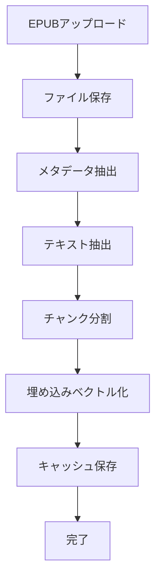
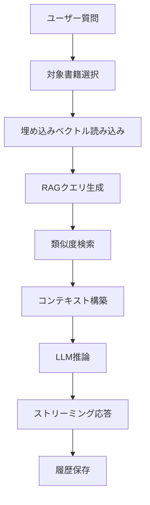
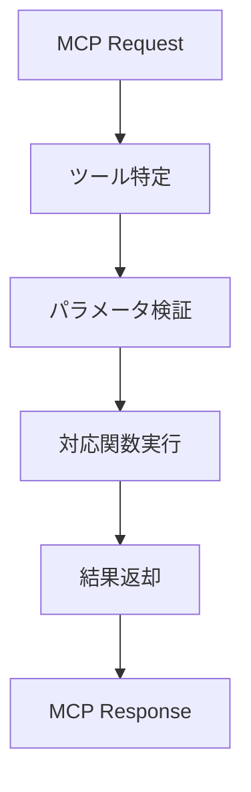

# EPUB LLM システム設計書

## 1. システム概要

### 1.1 システム構成
EPUB LLM システムは以下のコンポーネントで構成される：

- **FastAPI WebAPI** - メインアプリケーション
- **MLX LLM** - 言語モデル推論エンジン
- **FAISS検索エンジン** - 埋め込みベクトル検索
- **FastMCP Server** - MCP対応API
- **Web UI** - ユーザーインターフェース
- **ファイルストレージ** - EPUB・キャッシュファイル管理

### 1.2 アーキテクチャ概要
```
┌─────────────────┐    ┌─────────────────┐    ┌─────────────────┐
│   Web UI        │    │   MCP Client    │    │   External      │
│   (Browser)     │    │   (Claude etc)  │    │   Applications  │
└─────────────────┘    └─────────────────┘    └─────────────────┘
         │                       │                       │
         │ HTTP                  │ MCP Protocol         │ HTTP
         │                       │                       │
         v                       v                       v
┌─────────────────────────────────────────────────────────────────┐
│                    FastAPI Application                         │
│  ┌─────────────────┐    ┌─────────────────┐                   │
│  │   Web Endpoints │    │   FastMCP       │                   │
│  │   /chat, /      │    │   /mcp          │                   │
│  │   /bookshelf    │    │   tools         │                   │
│  └─────────────────┘    └─────────────────┘                   │
└─────────────────────────────────────────────────────────────────┘
         │                       │
         v                       v
┌─────────────────────────────────────────────────────────────────┐
│                    Business Logic Layer                        │
│  ┌─────────────────┐  ┌─────────────────┐  ┌─────────────────┐ │
│  │   EPUB Utils    │  │  Embedding Utils│  │  History Utils  │ │
│  │   - Extract     │  │  - Vectorize    │  │  - Save/Load    │ │
│  │   - Metadata    │  │  - Search       │  │  - Sessions     │ │
│  └─────────────────┘  └─────────────────┘  └─────────────────┘ │
└─────────────────────────────────────────────────────────────────┘
         │                       │                       │
         v                       v                       v
┌─────────────────┐    ┌─────────────────┐    ┌─────────────────┐
│   MLX Models    │    │   FAISS Index   │    │   File Storage  │
│   - LLM         │    │   - Embeddings  │    │   - EPUB files  │
│   - Embeddings  │    │   - Search      │    │   - Cache files │
└─────────────────┘    └─────────────────┘    └─────────────────┘
```

## 2. モジュール設計

### 2.1 app.py - メインアプリケーション
```python
class FastAPIApp:
    - models: MLX LLM・埋め込みモデル
    - endpoints: Web API エンドポイント
    - middleware: CORS・静的ファイル配信
    - configuration: ログ設定・ディレクトリ設定
```

**主要エンドポイント**:
- `GET /` - チャットUI
- `GET /bookshelf` - 書籍一覧API
- `GET /bookshelf_ui` - 書籍一覧UI
- `POST /chat` - チャット処理（ストリーミング）
- `POST /upload_epub` - EPUBアップロード
- `POST /delete_epub` - EPUB削除
- `GET /download_epub/{book_id}` - EPUBダウンロード
- `GET /history/{session_id}` - 履歴取得
- `POST /history/{session_id}` - 履歴保存

### 2.2 server.py - MCP Server
```python
class FastMCPServer:
    - mcp_app: FastMCP インスタンス
    - tools: MCP対応ツール群
    - integration: FastAPI統合
```

**MCPツール**:
- `list_epub_books()` - EPUB一覧取得
- `get_epub_metadata(book_id)` - メタデータ取得
- `search_epub_content(book_id, query, top_k)` - 内容検索
- `get_chat_histories()` - 履歴一覧取得
- `get_chat_history(session_id)` - 履歴取得

### 2.3 epub_util.py - EPUB処理
```python
class EPUBProcessor:
    - extract_epub_text(epub_path, output_path)
    - extract_epub_metadata(epub_path)
    - get_epub_cover_path(epub_path, cache_dir)
```

**機能**:
- EPUBファイルの構造解析
- テキストコンテンツ抽出
- メタデータ（タイトル、著者、出版年）抽出
- カバー画像抽出・キャッシュ

### 2.4 embedding_util.py - 埋め込み処理
```python
class EmbeddingProcessor:
    - create_embeddings_from_texts(texts, model, tokenizer)
    - save_embeddings(embeddings, texts, base_path)
    - load_embeddings(base_path)
    - build_faiss_index(embeddings)
    - search_similar(query, model, tokenizer, index, texts, top_k)
```

**機能**:
- テキストの埋め込みベクトル化
- 埋め込みベクトルのファイル保存・読み込み
- FAISS検索インデックス構築
- 類似度検索

### 2.5 history_util.py - 履歴管理
```python
class HistoryManager:
    - save_history(session_id, messages)
    - load_history(session_id)
    - HISTORY_DIR: 履歴ファイル保存ディレクトリ
```

**機能**:
- 会話履歴のJSON形式保存
- セッションID管理
- 履歴ファイル読み込み

## 3. データ設計

### 3.1 ディレクトリ構造
```
epub-llm/
├── src/
│   ├── app.py              # メインアプリケーション
│   ├── server.py           # MCP Server
│   ├── epub_util.py        # EPUB処理
│   ├── embedding_util.py   # 埋め込み処理
│   └── history_util.py     # 履歴管理
├── epub/                   # EPUBファイル保存
├── cache/                  # キャッシュファイル保存
│   ├── history/           # 会話履歴
│   ├── *.npy              # 埋め込みベクトル
│   ├── *.json             # テキストチャンク
│   └── *.txt              # 抽出テキスト
├── static/                # 静的ファイル
│   ├── cache/            # カバー画像キャッシュ
│   ├── chat.js           # チャットUI JavaScript
│   └── style.css         # スタイルシート
├── templates/             # HTMLテンプレート
│   ├── chat.html         # チャットUI
│   └── bookshelf.html    # 書籍一覧UI
└── docs/                  # ドキュメント
```

### 3.2 データフォーマット

**埋め込みベクトルファイル (.npy)**
```python
numpy.ndarray(shape=(chunks_count, embedding_dim), dtype=float32)
```

**テキストチャンクファイル (.json)**
```json
{
  "texts": ["chunk1", "chunk2", ...],
  "metadata": {
    "model": "multilingual-e5-base-mlx",
    "chunk_size": 4000,
    "overlap": 500
  }
}
```

**会話履歴ファイル (.json)**
```json
[
  {
    "role": "user",
    "content": "質問内容",
    "timestamp": "2024-01-01T00:00:00Z"
  },
  {
    "role": "assistant", 
    "content": "回答内容",
    "timestamp": "2024-01-01T00:00:01Z"
  }
]
```

## 4. 処理フロー設計

### 4.1 EPUB処理フロー


### 4.2 質問応答処理フロー


### 4.3 MCP API処理フロー


## 5. 性能設計

### 5.1 パフォーマンス最適化
- **埋め込みベクトルキャッシュ**: 一度生成したベクトルを再利用
- **FAISS高速検索**: 効率的な類似度検索
- **MLX最適化**: AppleシリコンでのML推論最適化
- **ストリーミング応答**: リアルタイムな応答配信

### 5.2 メモリ管理
- **モデル共有**: 埋め込みモデル・LLMの単一インスタンス
- **バッチ処理**: 埋め込みベクトル生成の効率化
- **キャッシュ管理**: 不要なデータの適切な解放

### 5.3 リソース制限
- **同時接続数**: 10ユーザー程度
- **ファイルサイズ**: EPUBファイル100MB以下
- **メモリ使用量**: 8GB以下で動作

## 6. エラーハンドリング設計

### 6.1 エラー分類
- **ファイルエラー**: EPUB読み込み失敗、キャッシュ不存在
- **モデルエラー**: MLX推論失敗、埋め込み生成失敗
- **検索エラー**: FAISS検索失敗、インデックス構築失敗
- **API エラー**: パラメータ不正、認証失敗

### 6.2 エラー処理方針
- **ログ記録**: 全エラーを適切にログ出力
- **ユーザー通知**: 分かりやすいエラーメッセージ
- **フォールバック**: 可能な限り代替処理実行
- **復旧機能**: 自動復旧・再試行機能

## 7. セキュリティ設計

### 7.1 入力検証
- **ファイル形式チェック**: EPUB形式のみ許可
- **ファイルサイズ制限**: 適切な上限設定
- **パス検証**: ディレクトリトラバーサル対策

### 7.2 データ保護
- **ローカル保存**: 外部送信なし
- **アクセス制御**: ファイル権限適切設定
- **データ暗号化**: 必要に応じて実装

## 8. 運用設計

### 8.1 ログ設計
- **ログレベル**: INFO以上を記録
- **ログ出力**: ファイル・コンソール両方
- **ログローテーション**: 日次・サイズ制限

### 8.2 監視・メトリクス
- **応答時間**: API レスポンス時間
- **エラー率**: 失敗率監視
- **リソース使用量**: CPU・メモリ使用率

### 8.3 バックアップ・復旧
- **設定ファイル**: 定期バックアップ
- **EPUBファイル**: ユーザー管理
- **キャッシュファイル**: 再生成可能

## 9. 拡張性設計

### 9.1 将来拡張
- **多言語対応**: 他言語埋め込みモデル
- **ファイル形式**: PDF・テキストファイル対応
- **検索機能**: 高度な検索オプション
- **UI改善**: より直感的なインターフェース

### 9.2 スケーラビリティ
- **並列処理**: 複数リクエスト同時処理
- **分散処理**: 複数サーバー対応
- **データベース**: 構造化データ管理

## 10. 開発・テスト方針

### 10.1 開発方針
- **モジュール分離**: 責務の明確な分離
- **型ヒント**: 適切な型注釈
- **ドキュメント**: コード・API文書充実

### 10.2 テスト方針
- **単体テスト**: 各機能の個別テスト
- **結合テスト**: モジュール間連携テスト
- **負荷テスト**: 性能・安定性テスト